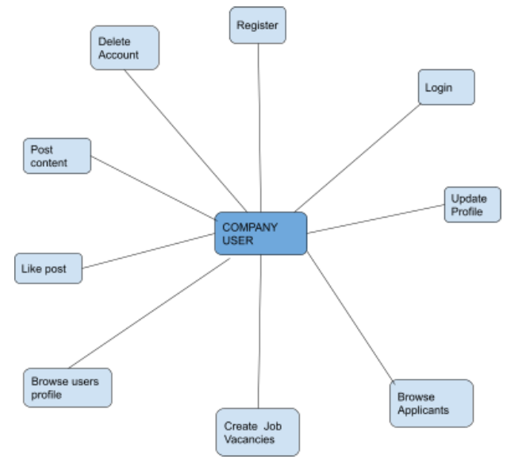
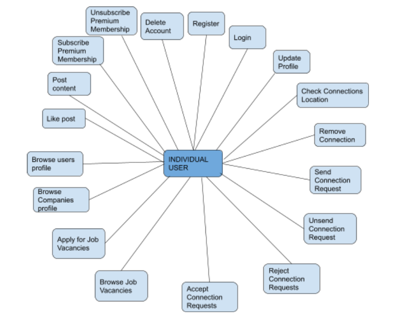
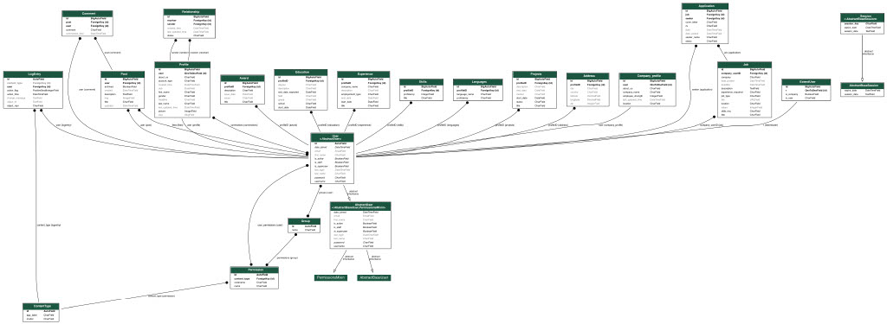
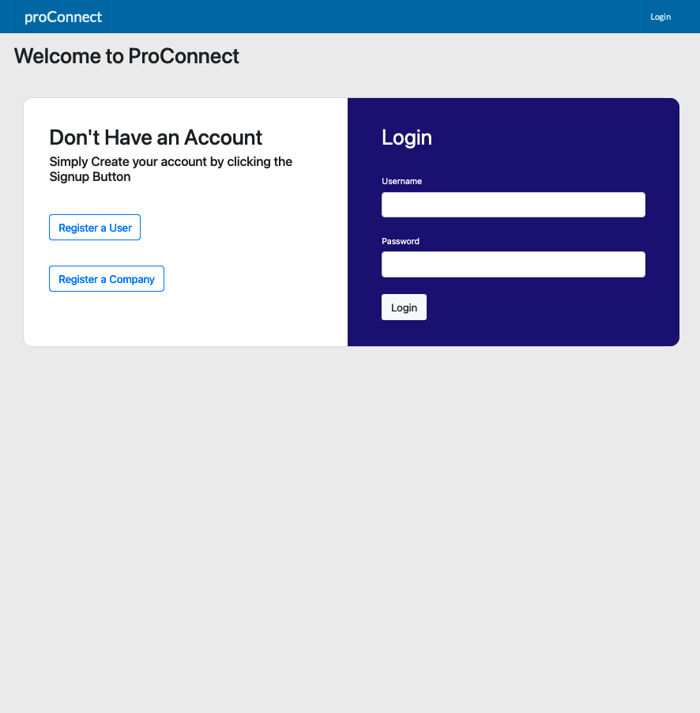
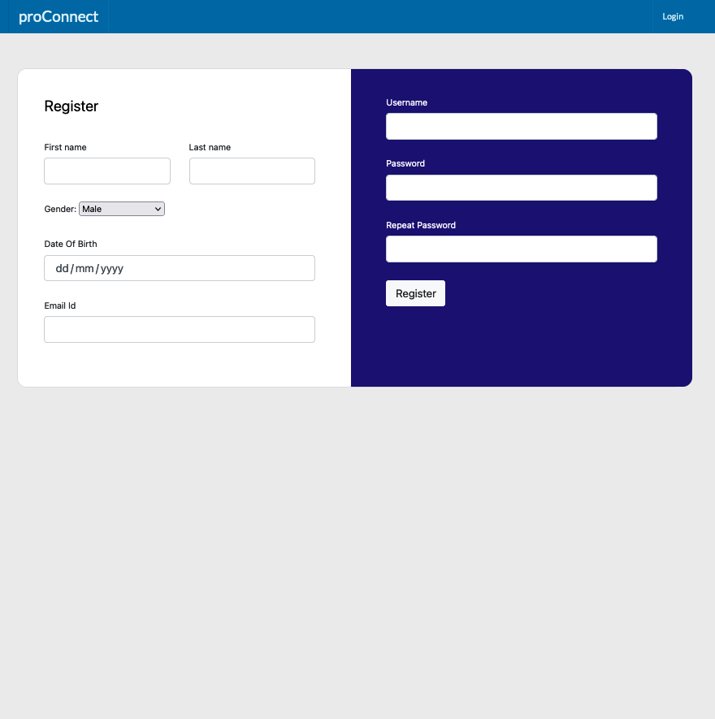
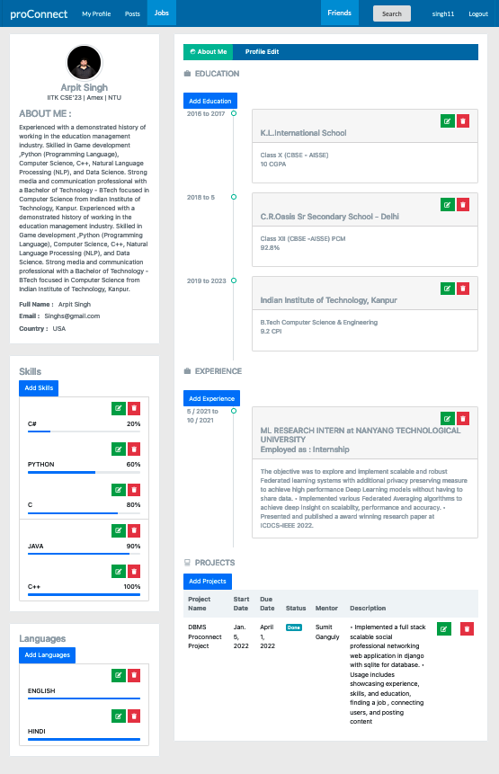
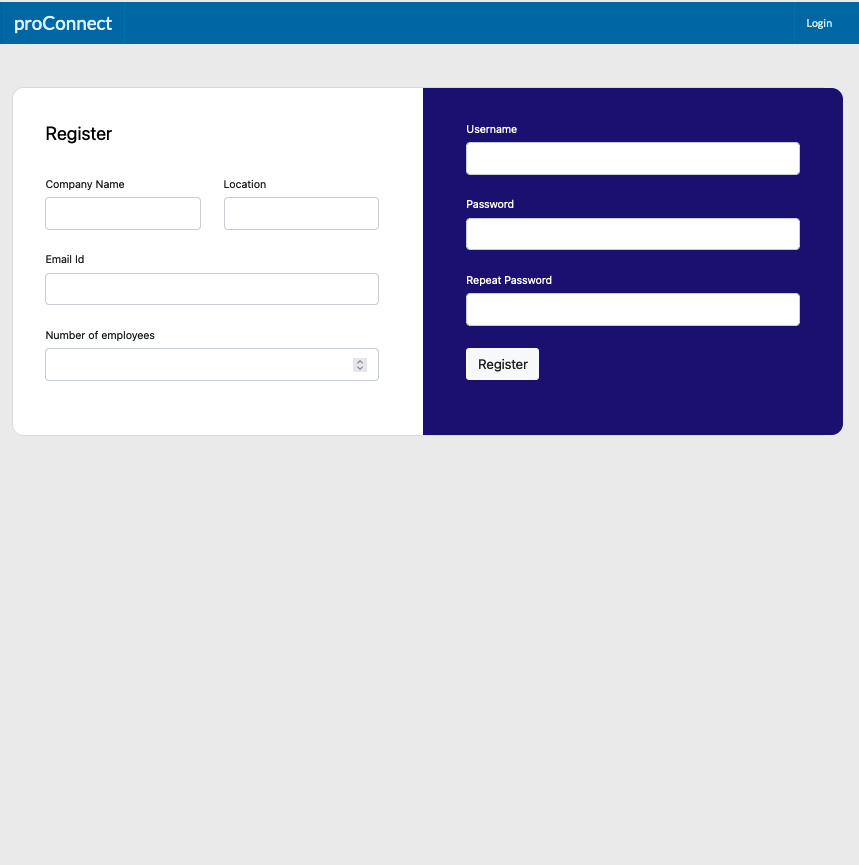
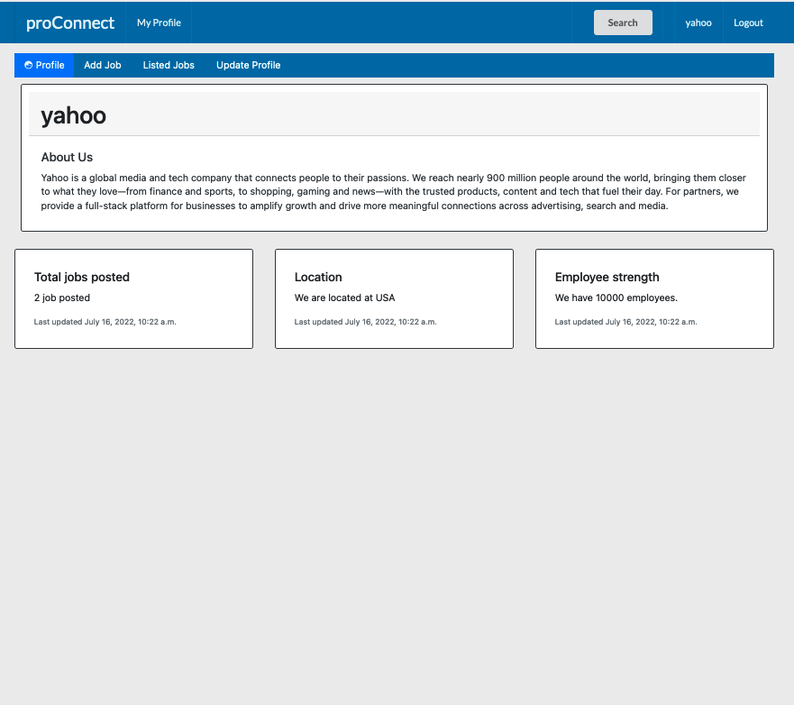
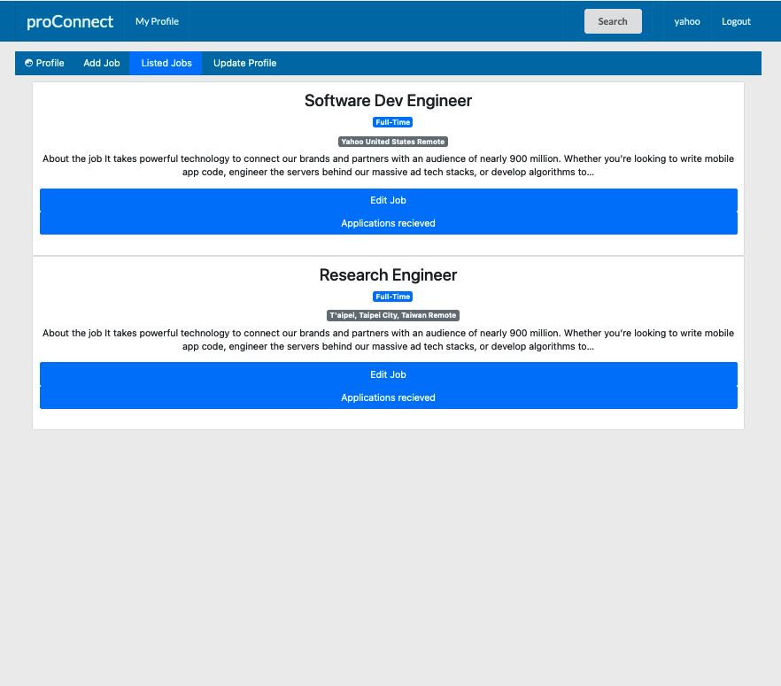
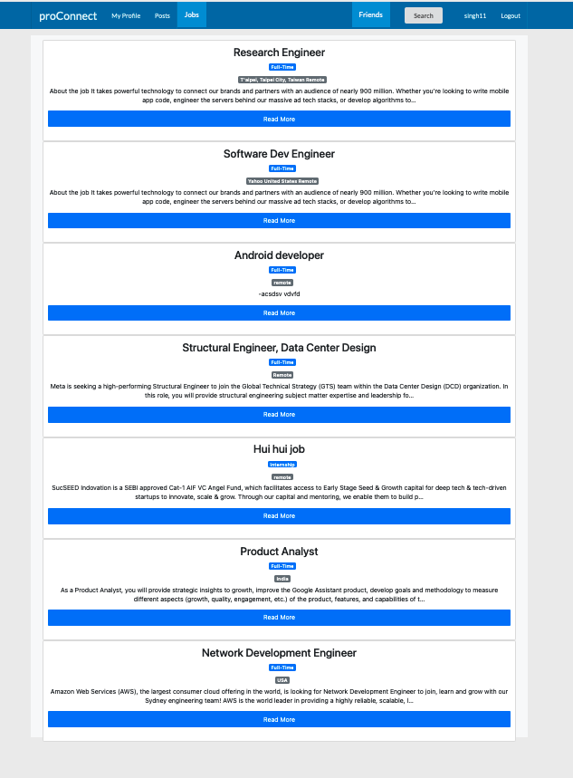

# Pro-Connect
Our app, ProConnect, is a professional networking web application. It offers services to two kinds of users which include the regular users and the companies. The companies can post job openings on the website whereas the users can apply for open job positions. All users can also post content on the website which will be visible to their connections. All users have a profile page which shows information about their education, projects, skills, experience among other details.
# Purpose:
One of the primary purposes of our app is to ease out the process for applying for and viewing job positions for users. It also eases out the process of filtering candidates for prospective jobs and also spreading news of job openings for the companies. Another of the important uses of the application is to make professional connections with other users.
..
# Vision:
The vision for this app is to build a one stop destination for job providers and job seekers. It should ease out the process for someone searching for a job as well as for a company looking for candidates for an open position.
# Different Kinds of Users and Functionalities provided to them:
* ###  Regular User 
This kind of user can create a profile, edit their profile according to needs, search and view other users profiles, send connection requests, accept/reject received connection requests, post contents with images , like other’s posts and comment on posts. One can also search, browse and apply for an open job position.
* ###  Company User 
These users create and edit their profiles. They can post and edit job openings as
well as view a list of applicants for the job along with their profiles and also search and view other users profiles.

# Functional Use Cases:

# A brief description of your backend and front end :
For the frontend part of the project, we have used HTML, CSS and Javascript. Advantage of using these languages is that they are supported by all browsers and they can be integrated with any backend framework. Also, they are lightweight and thus make the system faster.
For styling purposes, we used Bootstrap and Google Fonts. The advantage of using these frameworks in the frontend is that they help in creating responsive designs much faster than without them. They also provide cross-browser compatibility.
For the backend, we used Python with the Django framework. One of the biggest advantages of using the Django framework is that it is independent and complete in itself. It does not require any external solution. Django is everything from ORM to the web browser itself. Also codes in Django Framework are ‘Keep It Short and Simple’ and ‘Don’t repeat yourself’ compliant. Moreover, python also opens up the possibility to use machine learning or AI based components in the project.
As a database language we chose sqlite. Reasons for using this database language in place of others like MySQL and PostgreSQL are that sqlite is lightweight and thus provides better performance, does not require installation, is reliable and portable.
For version control and collaboration we used git and github respectively, github made communication between the team members very easy as all the contributors could review the pull requests locally and point out bugs and issues in the implementation and suggest changes that can be made, in a particular implementation. It made technical discussion very smooth and easy.

# ER Diagram

# Some Screens

## Login page
### Here both company user or normal user can login to their account.

##  User account register page.
### Here a normal user can create their account.

##  User Profile page
### Here a normal user can write about their skills, education , projects , experience etc.

##  Company account register page.
### Here a company user can create their account.

##  Company account home page 
### Here a company user can choose add a job, edit it's desciption and connect with applicants to their job.

##  A Company job listing page.
### Here a company user can edit or remove a listed job, and get list of all applicants of a job and accept/reject/or call for interview an applicant .

##  All Job Listing page.
### Here user can choose a job and open it's description.

